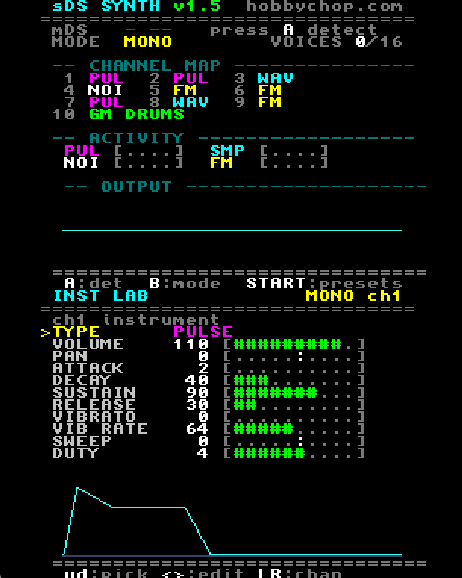

# sDS

An mGB-style MIDI synthesizer for the Nintendo DS and DS Lite. Your DS
becomes the instrument: send it MIDI from a keyboard, sequencer, or DAW
through the mDS slot-2 cartridge, and it plays the notes on the DS sound chip
with pulse, sample, noise, and FM voices.

Made by hobbychop.

## Getting started

1. Copy `sds_synth.nds` onto your slot-1 flashcart and launch it.
2. Put the mDS cartridge in the slot-2 port.
3. Press A to detect the cart. The top screen shows when it is connected.
4. Plug MIDI into the mDS and play.

The top screen is your monitor: connection, mode, the channel map, and a
live scope of the audio output. The bottom screen is the LAB, where you
shape the sound live with the d-pad.

## Playing it

Switch between three modes with B.

Mono is the classic mGB layout: nine separate instruments (MIDI channels
1-9), each one monophonic. The default voices are spread across the channels:

- Channels 1 and 2: pulse
- Channel 3: sample
- Channel 4: noise
- Channels 5 and 6: FM
- Channels 7, 8, 9: pulse, sample, FM

Send a Program Change on a channel to change its voice (0 pulse, 1 sample,
2 noise, 3 FM), so any channel can be any voice. The LAB follows along.

Semi is the same per-channel layout as Mono, but each channel can play
chords: extra notes borrow from a shared pool of six spare voices (first
come, first served) using that channel's settings. The pool is shared across
all channels, so a big chord on one channel uses it up.

Poly turns the whole synth into one instrument that plays chords. Choose its
voice (pulse, sample, noise, or FM) in the LAB, by Program Change, or with
CC 21.

Channel 10 is always a General MIDI drum kit in every mode. The note number
picks the drum (36 kick, 38 snare, 42 closed hat, 46 open hat, and so on).
The DRUMS page in the LAB tweaks the kit: pick a drum, then set its tune,
decay, level, and pan, plus the master level for all of them.

Pitch bend defaults to two semitones and honours the standard RPN bend-range
message for wider ranges; note velocity sets loudness.

## Buttons

- A: detect the cart
- B: cycle Mono / Semi / Poly
- Start: open the PRESETS page
- D-pad up and down: pick a setting in the LAB
- D-pad left and right: change the value
- L and R: switch LAB page (channels, DRUMS)
- X, Y, Select: on the PRESETS page, save / load / rename a slot

## Shaping the sound

Every setting in the LAB also responds to a MIDI control change, so you can
play it by hand or automate it from your sequencer. The controls below shape
the current instrument.

Performance

- CC 7: Volume
- CC 10: Pan (64 = center)
- CC 1: Vibrato depth
- CC 76: Vibrato rate (speed, not depth)
- CC 77: Pitch sweep (64 = off, below sweeps down, above sweeps up)

Envelope

- CC 73: Attack
- CC 75: Decay
- CC 70: Sustain
- CC 72: Release

Tone

- CC 16: Pulse duty
- CC 17: FM depth
- CC 18: FM ratio
- CC 79: FM feedback
- CC 19: Noise rate
- CC 20: Sample wave
- CC 21: Voice type

Panic and reset

- CC 120: All sound off
- CC 121: Reset controllers
- CC 123: All notes off

## Presets

The PRESETS page (press Start) holds 32 slots, each a snapshot of the whole
synth: all nine channels, the poly instrument, and the full drum kit (the
master level plus every drum's tune, decay, level, and pan).

- Up and down pick a slot; left and right jump by 8.
- X saves the current synth into the slot and Y loads it back, each after an
  A=yes / B=no confirmation.
- Select renames the slot (up and down change the letter, left and right move
  the cursor, Select again to finish).

Presets are written to your SD card as `sds_presets.dat`, so they survive a
power-off. If the card cannot be opened they still work for the session.

Send MIDI **CC 80** with a value of 0-31 to recall that preset slot from a
sequencer or controller.

## License

Released under CC BY-NC-SA 4.0. You are free to use, change, and share sDS for
non-commercial purposes, with attribution, under the same license. Selling sDS
or mDS units is not allowed.

You can make, perform, record, and sell music with it. The license only
restricts selling the device or the software itself.

The names sDS and mDS are reserved by the author. For commercial use, get in
touch through hobbychop.com.
